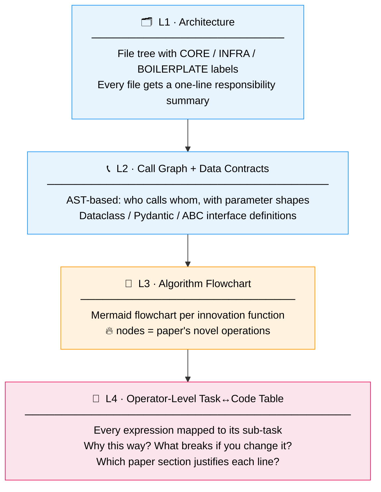
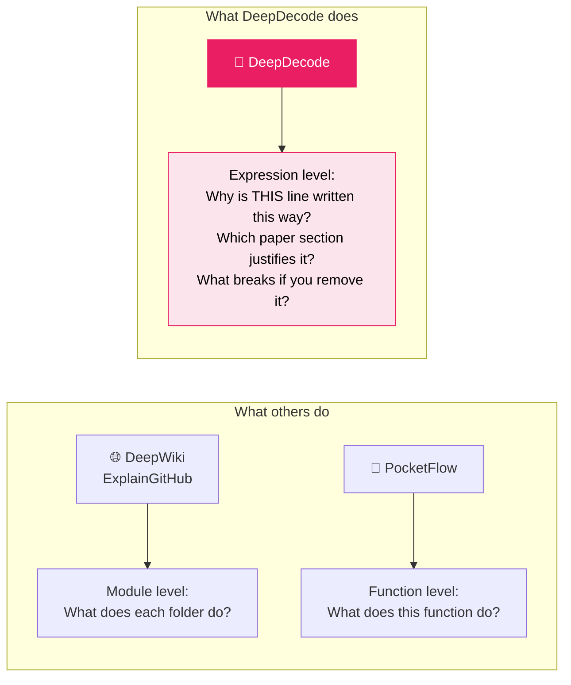
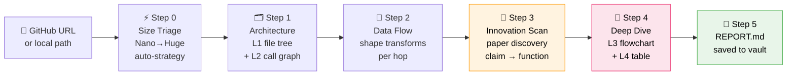

<div align="center">

# 🔍 DeepDecode · 深度解码

### *From paper claim to operator-level code — understand the why behind every line.*
### *从论文创新点到算子级代码，解码任务与代码之间的内在逻辑*

[](https://claude.ai/code)
[](https://github.com/noxinsun-source/DeepDecode)
[](LICENSE)

</div>

---

## Why DeepDecode?

Most code analysis tools stop at "what does this module do."
DeepDecode answers a harder question:

> **"Which function implements *this specific contribution* from the paper — and why is every line written exactly this way?"**

```
/full-analysis https://github.com/DEEP-PolyU/LinearRAG
```

```
✅ Step 0  LinearRAG — Nano tier (6 files / 1078 lines)
✅ Step 1  Architecture: 2 🔥 core files, 4 ⚙️ boilerplate
✅ Step 2  Data flow: 5 transformation hops
✅ Step 3  Paper found: LinearRAG ICLR'26 → 5 innovation functions located
❓ Step 4  Run L4 deep analysis on all 5 functions? [Y/n]
✅ Step 5  Report saved → 03.资料库/代码分析/LinearRAG/REPORT.md
```

---

## How Deep Does It Go?



> **L3 and L4 exist nowhere else.** Other tools explain architecture. DeepDecode explains *reasoning*.

---

## The L4 Table — What You Actually Get

A concrete excerpt from the [LinearRAG analysis](examples/linearrag-full-analysis.md):

| Code Expression | Sub-task | Why this way? | Paper |
|----------------|----------|---------------|-------|
| `np.dot(sent_emb, q_emb)` | Sentence–question relevance score | Cosine sim generalizes better than BM25; 4 orders of magnitude faster than LLM re-rank | §3.2.1 |
| `graph.add_edge(p_i, p_i+1)` | Build linear adjacent-passage chain | Eliminates LLM relation extraction entirely; O(\|P\|) vs O(\|P\|²) | §3.1, C2 |
| `nx.pagerank(G, personalization=seed)` | Personalized score propagation | Propagates farther than BFS; no GPU needed unlike attention | §3.3 |
| `scores[tier] *= damping ** tier` | Tier-based activation decay | Prevents score dilution across BFS hops | §3.2.2 |

---

## How DeepDecode Differs



| Capability | DeepWiki | ExplainGitHub | PocketFlow | **DeepDecode** |
|:-----------|:--------:|:-------------:|:----------:|:--------------:|
| Architecture overview | ✅ | ✅ | ✅ | ✅ |
| Call graph (AST-based) | 🟡 | ❌ | ❌ | ✅ |
| **Paper auto-discovery** | ❌ | ❌ | ❌ | ✅ |
| **Contribution claim → function** | ❌ | ❌ | ❌ | ✅ |
| **Boilerplate filtering** | ❌ | ❌ | ❌ | ✅ |
| **L3 algorithm flowchart** | ❌ | ❌ | 🟡 | ✅ |
| **L4 operator-level table** | ❌ | ❌ | ❌ | ✅ |
| **"Why this way" per line** | ❌ | ❌ | ❌ | ✅ |
| **Paper citation per expression** | ❌ | ❌ | ❌ | ✅ |
| Obsidian-native output | ❌ | ❌ | ❌ | ✅ |

---

## The Full Pipeline



**Paper auto-discovery** (Step 3) runs a 3-level fallback — no `--paper` argument needed:

```
Level 1 ── README grep      → finds arxiv / ACL / OpenReview links instantly
Level 2 ── Web search       → queries site:arxiv.org "[repo-name]"
Level 3 ── User PDF / Code  → you upload the PDF, or runs code-only heuristics
```

---

## The 7 Skills

| Command | What it does |
|---------|-------------|
| `/full-analysis [url]` | ⭐ Full pipeline, one command. Auto-sizes, auto-finds paper, all phases. |
| `/inno-scan [url]` | Paper discovery + map contribution claims → functions (grep-based, token-efficient) |
| `/code-explain [url] --file f.py --func Foo` | Single-function deep dive: L3 flowchart + L4 line-by-line task↔code table |
| `/repo-map [url]` | File tree with 🔥 CORE / 📦 INFRA / ⚙️ BOILERPLATE labels |
| `/repo-callgraph [url]` | AST call graph + data contracts (dataclass, Pydantic, ABC) |
| `/data-flow [url]` | Data shape transformations from input to output |
| `/repo-compare [url1] [url2]` | Side-by-side comparison of two repos solving the same problem |

---

## Installation

**Into an Obsidian vault** (recommended):
```bash
git clone https://github.com/noxinsun-source/DeepDecode \
  "/path/to/vault/.claude/skills/DeepDecode"
bash "/path/to/vault/.claude/skills/DeepDecode/install.sh" \
  "/path/to/vault/.claude/skills/"
```

**Standalone Claude Code**:
```bash
git clone https://github.com/noxinsun-source/DeepDecode ~/.claude/skills/DeepDecode
bash ~/.claude/skills/DeepDecode/install.sh ~/.claude/skills/
```

Open Claude Code and type `/full-analysis` — if it autocompletes, you're ready.

---

## Usage

```bash
# Simplest: just give the GitHub URL
/full-analysis https://github.com/user/repo

# Quick mode (architecture + innovation map, skip deep dive)
/full-analysis https://github.com/user/repo --mode quick

# Deep mode (full L4 line-by-line analysis on all core functions)
/full-analysis https://github.com/user/repo --mode deep

# Already have the paper PDF?
/full-analysis https://github.com/user/repo --paper /path/to/paper.pdf

# Point at one specific function you want to understand
/code-explain https://github.com/user/repo --file src/model.py --func train_step

# Resume an interrupted session
/full-analysis https://github.com/user/repo --resume
```

Works on any repo size. Repos with 500k+ lines of code are handled by switching to grep-only mode — the paper-guided innovation scan stays token-efficient at any scale.

---

## Example Output

See [`examples/linearrag-full-analysis.md`](examples/linearrag-full-analysis.md) — a complete analysis of [LinearRAG (ICLR 2026)](https://arxiv.org/abs/2510.10114), including:
- Paper claim → function mapping table (5 innovations)
- L3 algorithm flowcharts for each core function
- L4 line-by-line task↔code tables with paper citations

---

## Platforms

Works in any environment where Claude Code runs:

| Platform | How to use |
|----------|-----------|
| **Claude Code CLI** | `cd your-vault && claude`, then type commands |
| **VS Code + Claude Code extension** | Type commands in the sidebar panel |
| **Obsidian + Claudian plugin** | Type commands in the right-side panel |

Results are saved as Markdown in your vault — Mermaid diagrams render natively in Obsidian.
