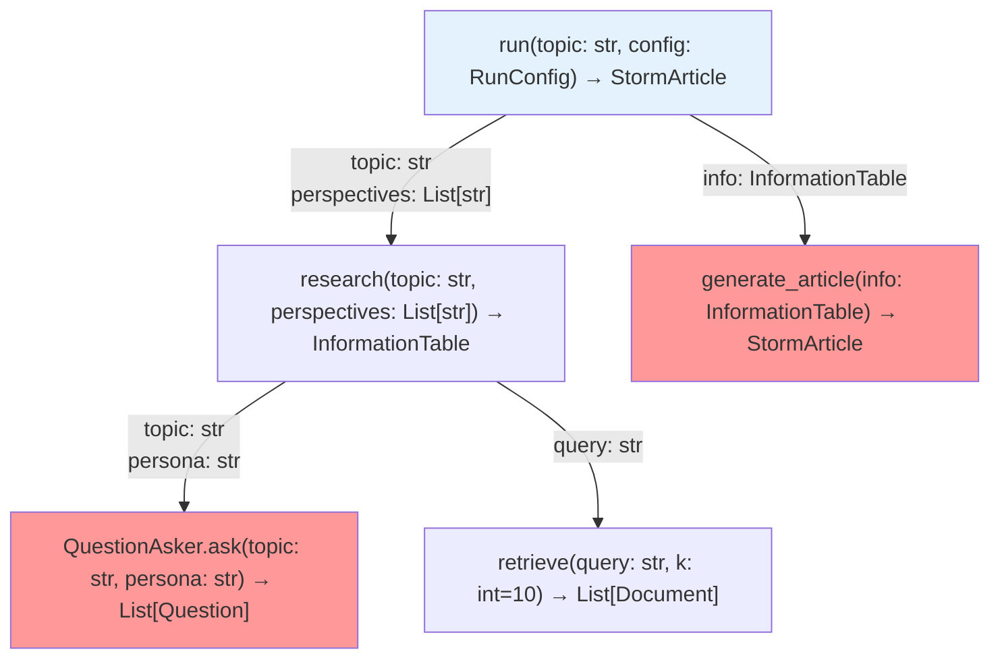
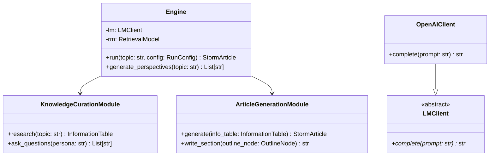
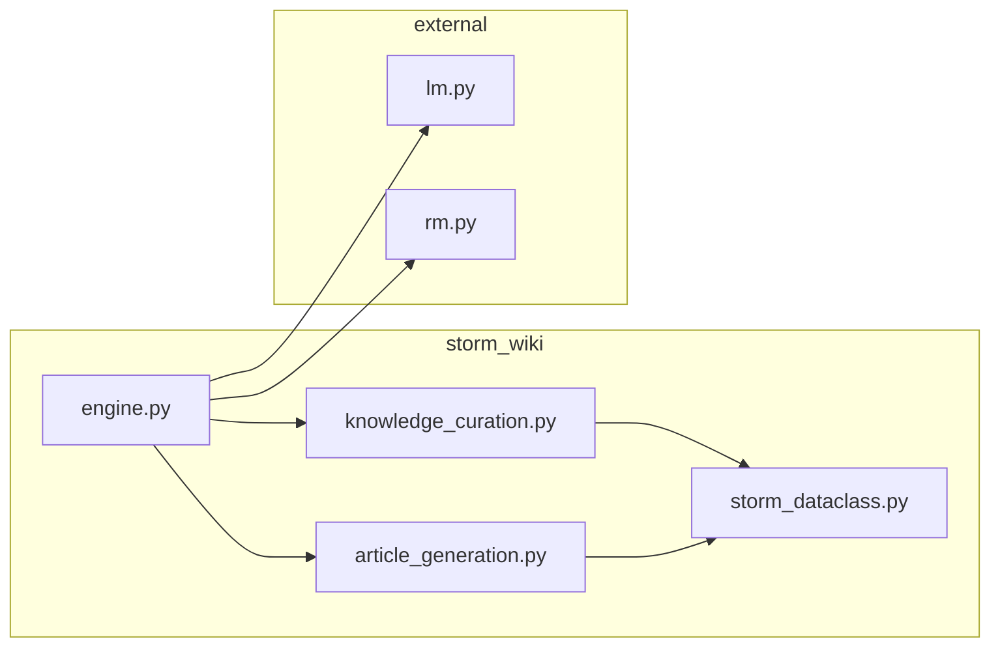

# /repo-callgraph — 函数调用图 + 参数类型（AST 解析）

**定位**：用 Python 标准库 `ast` 做静态分析，提取真实的函数签名和调用关系。
生成带参数类型标注的 Mermaid 调用图——不只是"A 调用 B"，而是"A 把什么形状的数据传给 B"。

**技术基础**：Python AST 静态分析（无需执行代码，无需安装额外依赖）

---

## VAULT PATH MAPPING

- 输出：`03.资料库/代码分析/[repo名]-callgraph.md`

---

## 调用格式

```
# 分析整个 repo 的核心模块
/repo-callgraph https://github.com/user/repo

# 只分析指定文件（推荐：/inno-scan 后使用）
/repo-callgraph https://github.com/user/repo --files engine.py,knowledge_curation.py

# 从入口函数出发，追踪 N 层调用
/repo-callgraph https://github.com/user/repo --entry main.py::run --depth 3
```

---

## WORKFLOW

### Step 1：准备目标文件

若已有 `/repo-preflight` 或 `/inno-scan` 的结果：读取 vault 中的分析文档，提取核心文件列表。
否则：克隆 repo（`--depth=1 --filter=blob:none --sparse`），检出目标文件。

### Step 2：AST 签名提取（通过 Bash 运行 Python）

```bash
python3 << 'EOF'
import ast, json, sys
from pathlib import Path

def extract_signatures(filepath):
    """提取文件中所有函数/方法的完整签名"""
    with open(filepath) as f:
        source = f.read()
    tree = ast.parse(source)
    
    results = []
    for node in ast.walk(tree):
        if isinstance(node, (ast.FunctionDef, ast.AsyncFunctionDef)):
            # 参数列表（含类型注解）
            args = []
            for arg in node.args.args:
                if arg.arg == 'self': continue
                ann = ast.unparse(arg.annotation) if arg.annotation else 'Any'
                args.append({'name': arg.arg, 'type': ann})
            
            # 默认值
            defaults = [ast.unparse(d) for d in node.args.defaults]
            
            # 返回值类型
            ret = ast.unparse(node.returns) if node.returns else 'Any'
            
            # Docstring（首行）
            docstring = ''
            if (node.body and isinstance(node.body[0], ast.Expr)
                    and isinstance(node.body[0].value, ast.Constant)):
                docstring = node.body[0].value.value.split('\n')[0].strip()
            
            results.append({
                'name': node.name,
                'args': args,
                'return': ret,
                'docstring': docstring,
                'line': node.lineno,
                'is_async': isinstance(node, ast.AsyncFunctionDef)
            })
    return results

# 对每个目标文件运行
for filepath in sys.argv[1:]:
    sigs = extract_signatures(filepath)
    print(json.dumps({'file': filepath, 'functions': sigs}, indent=2))
EOF
/tmp/repostrata-[repo]/engine.py /tmp/repostrata-[repo]/knowledge_curation.py
```

### Step 3：AST 调用关系提取

```bash
python3 << 'EOF'
import ast, json, sys

def extract_calls(filepath):
    """提取文件中每个函数内部的所有函数调用"""
    with open(filepath) as f:
        tree = ast.parse(f.read())
    
    call_map = {}
    for node in ast.walk(tree):
        if isinstance(node, (ast.FunctionDef, ast.AsyncFunctionDef)):
            calls = []
            for child in ast.walk(node):
                if isinstance(child, ast.Call):
                    # 提取被调用的函数名
                    if isinstance(child.func, ast.Attribute):
                        callee = f"{ast.unparse(child.func.value)}.{child.func.attr}"
                    elif isinstance(child.func, ast.Name):
                        callee = child.func.id
                    else:
                        continue
                    
                    # 提取传入的参数表达式（推断传递的数据类型）
                    call_args = [ast.unparse(a) for a in child.args]
                    call_kwargs = {kw.arg: ast.unparse(kw.value) for kw in child.keywords}
                    
                    calls.append({
                        'callee': callee,
                        'args': call_args,
                        'kwargs': call_kwargs
                    })
            
            call_map[node.name] = calls
    return call_map

for filepath in sys.argv[1:]:
    calls = extract_calls(filepath)
    print(json.dumps({'file': filepath, 'calls': calls}, indent=2))
EOF
```

### Step 4：类层次提取

```bash
python3 << 'EOF'
import ast, json, sys

def extract_classes(filepath):
    with open(filepath) as f:
        tree = ast.parse(f.read())
    
    classes = []
    for node in ast.walk(tree):
        if isinstance(node, ast.ClassDef):
            bases = [ast.unparse(b) for b in node.bases]
            methods = [n.name for n in ast.walk(node)
                      if isinstance(n, (ast.FunctionDef, ast.AsyncFunctionDef))]
            classes.append({
                'name': node.name,
                'bases': bases,      # 父类
                'methods': methods,  # 方法列表
                'line': node.lineno
            })
    return classes

for filepath in sys.argv[1:]:
    classes = extract_classes(filepath)
    print(json.dumps({'file': filepath, 'classes': classes}, indent=2))
EOF
```

### Step 5：生成 Mermaid 调用图

基于 Step 2-4 的数据，生成三种 Mermaid 图：

#### 图 A：函数调用图（带参数类型）

````markdown

````

#### 图 B：类继承图

````markdown

````

#### 图 C：模块依赖图（`__init__.py` 导入分析）

````markdown

````

### Step 6：参数约束注释

对每个函数调用边，补充参数约束信息（从 docstring 和类型注解提取）：

```markdown
### 参数约束说明

| 函数 | 参数 | 类型 | 约束/说明 |
|------|------|------|---------|
| `retrieve(query, k)` | `query` | `str` | 自然语言查询，非 embedding |
| `retrieve(query, k)` | `k` | `int` | 默认 10，建议 5-20 |
| `QuestionAsker.ask(topic, persona)` | `persona` | `str` | 模拟的 Wikipedia 编辑者视角描述 |
| `Engine.run(topic, config)` | `config` | `RunConfig` | 见 storm_dataclass.py::RunConfig |
```

---

## OUTPUT FORMAT

```markdown
---
date: YYYY-MM-DD
repo: [URL]
tags: [source/code-analysis]
skill: repo-callgraph
analyzed_files: [engine.py, knowledge_curation.py, ...]
---

# 📞 Call Graph：[repo-name]

## 类层次结构

[Mermaid classDiagram]

## 函数调用图（带参数类型）

[Mermaid graph TD，边上有参数类型标注]

## 模块依赖图

[Mermaid graph LR]

## 参数约束详情

[表格：函数 × 参数 × 类型 × 约束]

## 数据形状汇总

| 变量/参数 | 类型 | 具体形状/范围 |
|---------|------|------------|
| `tokens` | `Tensor` | `[batch_size, seq_len]` |
| `embeddings` | `Tensor` | `[batch_size, seq_len, hidden_dim]` |
| `perspectives` | `List[str]` | 通常 3-5 个元素 |
```

---

## 上下文预算

| 操作 | Token |
|------|-------|
| AST 脚本输出（3 个文件的签名+调用）| ~5,000 |
| Mermaid 图生成（3 张）| ~2,000 |
| 参数约束表生成 | ~1,500 |
| **总计** | **~8,500** |

AST 分析结果远比读取完整文件更紧凑——3 个 1000 行文件的签名信息压缩后只有 ~200 行。
