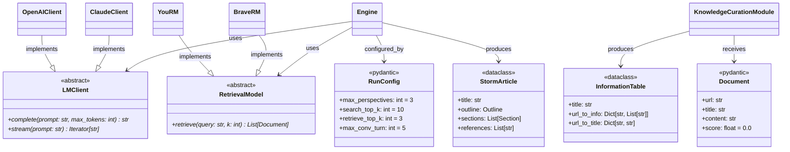

# /repo-interfaces — 接口与数据契约提取

**定位**：提取代码中所有"数据形状定义"——这是理解系统边界、模块间协议的关键。

**覆盖范围**：
- `ABC` / `abstractmethod`：抽象接口（"必须实现什么"）
- `Protocol`（typing）：结构化子类型接口（"鸭子类型的形式化"）
- `Pydantic BaseModel`：数据验证模型（常见于现代 ML 系统的配置和输入输出）
- `dataclass`：轻量数据容器
- `TypedDict`：字典的类型注解形式
- `__all__`：模块公开 API 声明

**为什么重要**：接口定义是"模块间的合同"，读懂接口比读具体实现更高效。

---

## VAULT PATH MAPPING

- 输出：`03.资料库/代码分析/[repo名]-interfaces.md`

---

## 调用格式

```
/repo-interfaces https://github.com/user/repo
/repo-interfaces https://github.com/user/repo --files storm_dataclass.py,interface.py
```

---

## WORKFLOW

### Step 1：定位接口文件

优先扫描以下文件（高概率含接口定义）：
```bash
find $REPO -name "*.py" | xargs grep -l \
  "ABC\|Protocol\|BaseModel\|dataclass\|TypedDict\|abstractmethod" \
  | grep -vE "test_|__pycache__" | sort
```

### Step 2：AST 提取各类接口

```bash
python3 << 'EOF'
import ast, json, sys

def extract_interfaces(filepath):
    with open(filepath) as f:
        source = f.read()
    tree = ast.parse(source)
    
    interfaces = {
        'abstract_classes': [],
        'protocols': [],
        'pydantic_models': [],
        'dataclasses': [],
        'typed_dicts': [],
        'public_api': []
    }
    
    for node in ast.walk(tree):
        if not isinstance(node, ast.ClassDef):
            continue
        
        base_names = [ast.unparse(b) for b in node.bases]
        decorators = [ast.unparse(d) for d in node.decorator_list]
        
        # 提取所有字段和方法
        fields = []
        methods = []
        abstract_methods = []
        
        for item in node.body:
            # 字段（有类型注解的赋值）
            if isinstance(item, ast.AnnAssign):
                ann = ast.unparse(item.annotation)
                default = ast.unparse(item.value) if item.value else 'required'
                fields.append({'name': ast.unparse(item.target), 
                               'type': ann, 'default': default})
            
            # 方法
            if isinstance(item, (ast.FunctionDef, ast.AsyncFunctionDef)):
                is_abstract = any('abstractmethod' in ast.unparse(d) 
                                  for d in item.decorator_list)
                args = []
                for arg in item.args.args:
                    if arg.arg == 'self': continue
                    ann = ast.unparse(arg.annotation) if arg.annotation else 'Any'
                    args.append(f"{arg.arg}: {ann}")
                ret = ast.unparse(item.returns) if item.returns else 'Any'
                method_sig = f"{item.name}({', '.join(args)}) -> {ret}"
                
                if is_abstract:
                    abstract_methods.append(method_sig)
                else:
                    methods.append(method_sig)
        
        # 判断类型
        entry = {
            'name': node.name,
            'bases': base_names,
            'fields': fields,
            'abstract_methods': abstract_methods,
            'concrete_methods': methods,
            'line': node.lineno
        }
        
        if 'ABC' in base_names or any('ABC' in b for b in base_names):
            interfaces['abstract_classes'].append(entry)
        elif 'Protocol' in base_names:
            interfaces['protocols'].append(entry)
        elif 'BaseModel' in base_names:
            interfaces['pydantic_models'].append(entry)
        elif 'dataclass' in decorators or '@dataclass' in decorators:
            interfaces['dataclasses'].append(entry)
        elif 'TypedDict' in base_names:
            interfaces['typed_dicts'].append(entry)
    
    # __all__ 提取
    for node in ast.walk(tree):
        if (isinstance(node, ast.Assign) and 
            any(isinstance(t, ast.Name) and t.id == '__all__' for t in node.targets)):
            if isinstance(node.value, (ast.List, ast.Tuple)):
                interfaces['public_api'] = [ast.unparse(e) for e in node.value.elts]
    
    return interfaces

for filepath in sys.argv[1:]:
    result = extract_interfaces(filepath)
    print(json.dumps({'file': filepath, 'interfaces': result}, indent=2))
EOF
```

### Step 3：生成接口契约文档

#### Mermaid classDiagram（完整接口图）

````markdown

````

#### 接口-实现对照表

```markdown
## 接口-实现对照表

### LMClient（抽象 LLM 接口）

**必须实现的方法**：
| 方法签名 | 说明 |
|---------|------|
| `complete(prompt: str, max_tokens: int) -> str` | 单次补全 |
| `stream(prompt: str) -> Iterator[str]` | 流式输出 |

**已有实现**：
| 实现类 | 文件 | 覆盖程度 |
|--------|------|---------|
| `OpenAIClient` | lm.py | ✅ 完整 |
| `ClaudeClient` | lm.py | ✅ 完整 |

---

### RunConfig（运行配置，Pydantic 验证）

| 字段 | 类型 | 默认值 | 约束 |
|------|------|--------|------|
| `max_perspectives` | `int` | `3` | 控制视角数量，建议 2-5 |
| `search_top_k` | `int` | `10` | 每次搜索返回数量 |
| `retrieve_top_k` | `int` | `3` | 最终保留文档数 |
| `max_conv_turn` | `int` | `5` | 对话最大轮次 |
```

---

## OUTPUT FORMAT

```markdown
---
date: YYYY-MM-DD
repo: [URL]
tags: [source/code-analysis]
skill: repo-interfaces
---

# 🔌 Interfaces & Contracts：[repo-name]

## 接口全景图（Mermaid classDiagram）

[完整的接口继承 + 实现 + 使用关系图]

## 抽象接口（必须实现的契约）

[每个 ABC / Protocol 的必需方法签名]

## 数据模型（Pydantic / dataclass / TypedDict）

[每个模型的字段表格：名称 × 类型 × 默认值 × 约束说明]

## 公开 API 清单（__all__）

[模块对外暴露的内容]

## 接口使用关系

[谁用了哪个接口 → 调用了哪些方法]
```

---

## 上下文预算

| 操作 | Token |
|------|-------|
| grep 定位接口文件（文件名列表）| ~300 |
| AST 接口提取输出 | ~4,000 |
| Mermaid classDiagram 生成 | ~2,000 |
| 字段约束表生成 | ~2,000 |
| **总计** | **~8,300** |
